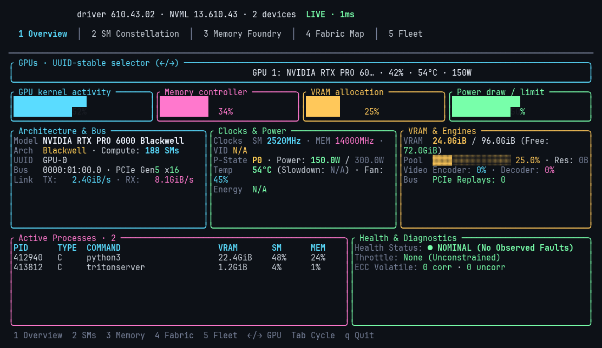
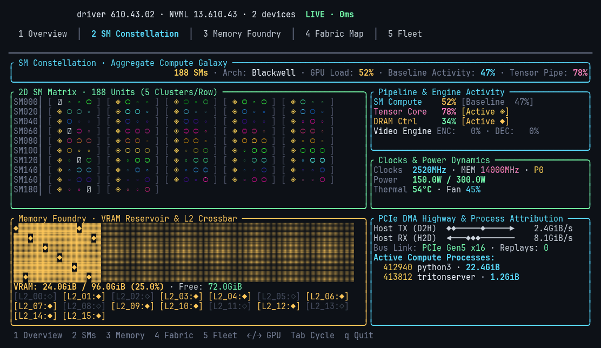
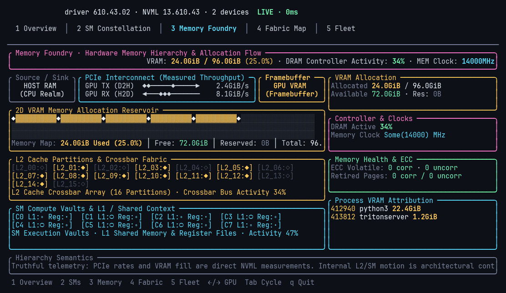
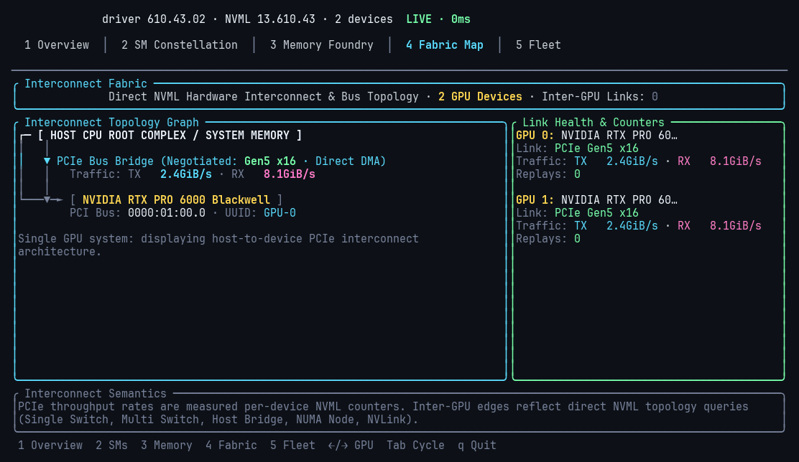
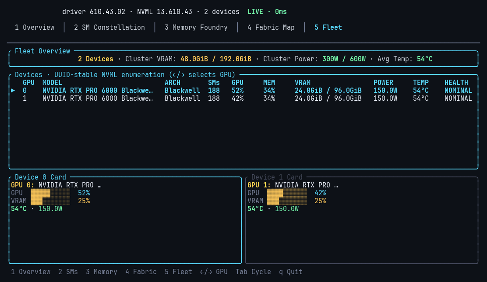

# nv-toplike

**Real-time NVIDIA GPU telemetry with hardware-grounded terminal visuals.**

`nv-toplike` is a high-density, low-overhead GPU monitoring dashboard and diagnostic tool built in Rust. It interacts with the NVIDIA Management Library (**NVML**) directly without spawning subshells or polling `nvidia-smi`, providing sub-millisecond hardware telemetry, bottleneck detection, memory hierarchy mapping, and cluster observability.

---

## Key Features

- **Direct NVML Integration**: Read-only, unprivileged, low-overhead hardware telemetry without child process overhead.
- **Bottleneck Identification**: Real-time breakdown of **SM Compute**, **Tensor Pipe**, **DRAM Controller**, and **PCIe Direct DMA** transfer rates.
- **2D SM Compute Matrix**: Responsive hardware-anchored SM core galaxy with dynamic HSV temperature gradient and tensor pipe detection.
- **Full Memory Hierarchy**: Multi-tier VRAM allocation reservoir, L2 cache crossbar partitions, SM local SRAM vaults, and volatile ECC error tracking.
- **PCIe & NVLink Fabric**: Host-to-device bus tree diagram, link generation/width negotiation, replay counters, and inter-GPU topology queries.
- **Zero Hallucination / Proxying**: If a metric is unsupported by hardware or driver, it displays as `N/A` rather than faking data with proxy numbers.
- **Machine-Readable JSON**: `--json` headless output format for automated monitoring and data pipelines.

---

## Visual Views & Walkthrough

`nv-toplike` features 5 dedicated views tailored for development, training, and cluster management.

### View 1: Overview (`Key: 1`)
*The primary operational cockpit providing at-a-glance hardware telemetry, clock stepping, power budget, and process attribution.*



- **Operational Gauges**: Instant load feedback for GPU Core %, VRAM Fill %, Board Power vs. Budget, and Thermal & Fan speed.
- **Clocks & Stepping**: SM Clock, Memory Clock, P-State scaling (`P0`–`P12`), and hardware throttling detection.
- **Process Attribution**: Real-time table of active compute jobs, PIDs, commands, and dedicated VRAM allocations.

---

### View 2: SM Constellation (`Key: 2`)
*Dynamic 2D Streaming Multiprocessor compute matrix coupled with live pipeline telemetry.*



- **SM Compute Matrix**: Hardware-scaled 2D execution matrix with dynamic HSV core temperatures and sparkle spikes.
- **Glyph Legend**: `·` (Idle), `∘` (Low Load), `○` (Moderate), `◉` (Active), `●` (Full Load), `✦` (Spike), `◈` (Tensor Core).
- **Pipeline Activity**: Real-time compute utilization breakdown (SM execution, Tensor Pipe %, DRAM Controller %, Video Encoder/Decoder).
- **DMA Highway**: Real-time host-to-device DMA transfer channels.

---

### View 3: Memory Foundry (`Key: 3`)
*Deep-dive physical memory hierarchy from on-chip SRAM to physical DRAM and ECC health.*



- **2D VRAM Reservoir Block Map**: High-resolution memory block grid (`▓` allocated, `░` free) with active memory controller packets (`◆`).
- **16-Partition L2 Cache Crossbar**: Visualizes cache crossbar slices and real-time hit/routing activity.
- **SM Local Execution Vaults**: 8-cluster SRAM/register array representing L1 data cache and register files.
- **Hardware & Reliability Deck**: Controller clocks, memory bandwidth, volatile ECC error tracking (single/double-bit), and page retirements.

---

### View 4: Fabric Map (`Key: 4`)
*Host-to-device PCIe tree topology, NUMA node binding, and inter-GPU interconnect matrix.*



- **Bus Tree Diagram**: Displays Root Complex, PCIe Switch bridges, link generation/width (`Gen5 x16`), and DMA data channels.
- **Multi-GPU Topology**: Identifies direct NVLink, PCIe Host Bridge, Single Switch (PIX), or NUMA cross-socket routing.
- **Jitter-Free DMA Channels**: Directional transfer speed counters (`Host TX ──▶` and `Host RX ◀──`) with fixed-width alignment.

---

### View 5: Fleet (`Key: 5`)
*Multi-GPU cluster overview and node distribution.*



- **Cluster Aggregate Summary**: Total cluster compute load, collective VRAM consumption, cluster board power draw, and average thermal profile.
- **Device Grid**: Compact GPU status cards with individual load and memory gauges for all visible accelerators.

---

## Installation & Build

### Prerequisites
- NVIDIA GPU with driver installed (NVIDIA Display Driver 450.00+ or later).
- Rust 1.88+ and Cargo toolchain.

### Building from Source

```bash
git clone https://github.com/npow/nv-toplike.git
cd nv-toplike

# Build optimized release binary
cargo build --release

# Run interactive TUI
./target/release/nv-toplike
```

---

## Usage & Controls

### Keyboard Navigation

| Key | Action |
|---|---|
| `1` | **Overview**: Operational gauges, clocks, power, processes, and diagnostics |
| `2` | **SM Constellation**: 2D SM galaxy, tensor pipe, and pipeline telemetry |
| `3` | **Memory Foundry**: VRAM reservoir map, L2 cache crossbar, and ECC health |
| `4` | **Fabric Map**: PCIe tree, DMA transport highway, and topology |
| `5` | **Fleet**: Multi-GPU cluster summary and per-device status cards |
| `Tab` | Cycle sequentially through all views |
| `←` / `→` | Switch active GPU on multi-GPU systems |
| `q` / `Esc` | Quit `nv-toplike` |

### CLI Options

```bash
# Launch directly into a specific view
nv-toplike --mode constellation
nv-toplike --mode memory
nv-toplike --mode fabric
nv-toplike --mode fleet

# Custom refresh rate (frames per second)
nv-toplike --fps 30

# Headless JSON export (single snapshot to stdout)
nv-toplike --json

# Run against a mock fixture device
nv-toplike --fixture blackwell-rtx6000
```

---

## Troubleshooting & Diagnostics

- **Missing Metrics / `N/A`**: Consumer or workstation GeForce cards without ECC or aggregate power sensors will display `N/A` for those specific fields. This is intentional to ensure zero metric hallucination.
- **Permission Requirements**: `nv-toplike` is read-only and runs under any standard unprivileged user account. Root / `sudo` access is **not** required.

---

## License

Apache-2.0. See [LICENSE](LICENSE) for details.
